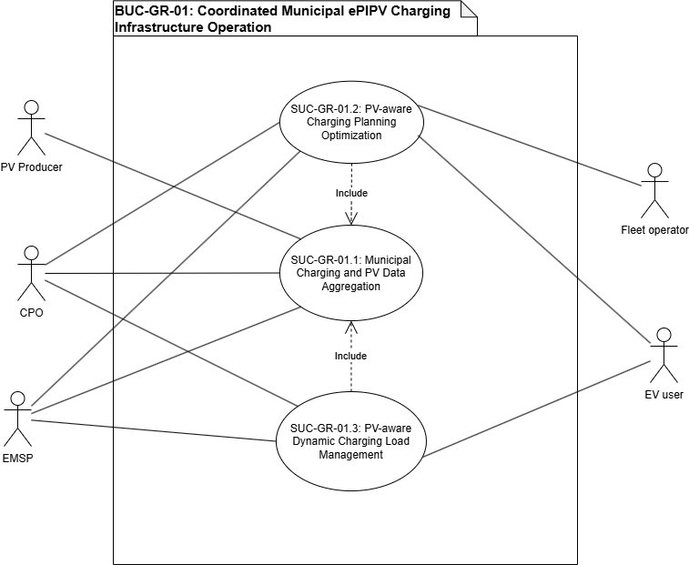
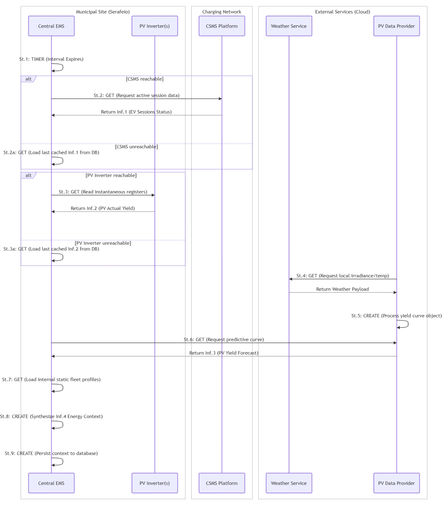
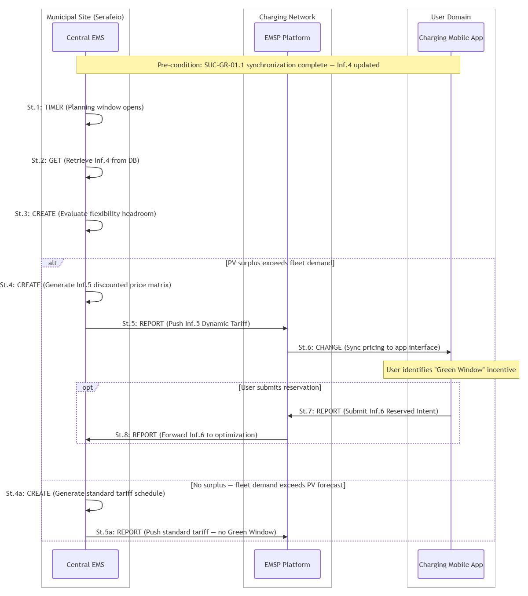
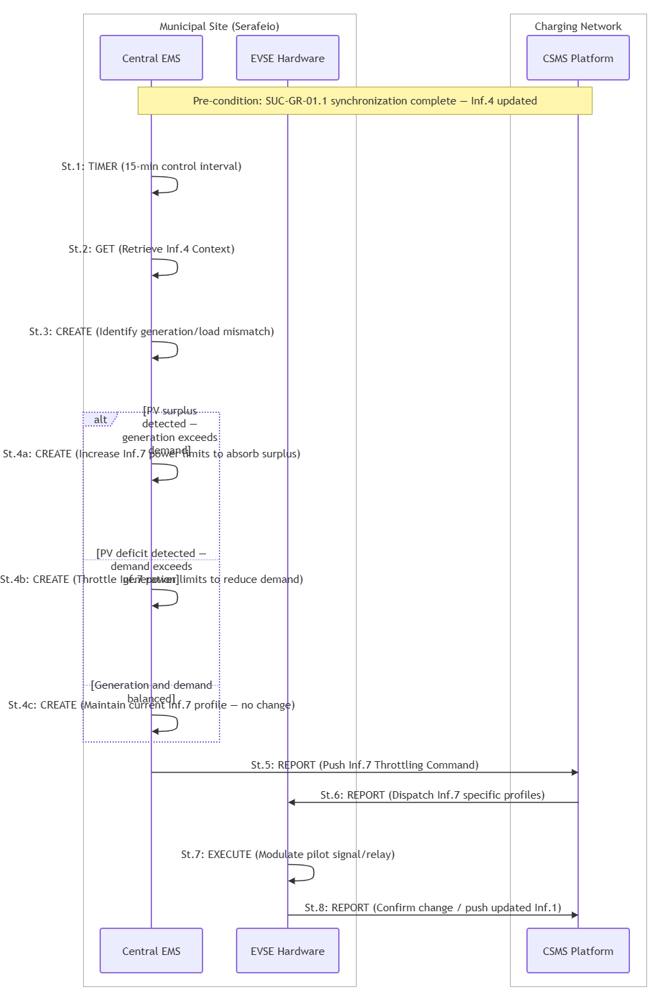

# BUC-GR-01 — Coordinated Municipal ePIPV Charging Infrastructure Operation

> **SOLAR-MOVE — Greek Demonstrator (Athens / DAEM — Serafeio Complex)**
> Business Use Case following the IEC 62559-2 template.

| | |
|---|---|
| **Use Case ID** | BUC-GR-01 |
| **Document** | SOLARMOVE_BUC-GR-01 |
| **Version** | v0.8 |
| **Area** | Energy System |
| **Domains** | Distribution System, DER, Customer Premises |
| **Zones** | Operation, Enterprise, Market |
| **Work Package / Task** | WP1 — T1.3 |

---

## Table of contents

1. [Description of the use case](#1-description-of-the-use-case)
2. [Diagrams of the use case](#2-diagrams-of-the-use-case)
3. [Technical details](#3-technical-details)
4. [Step-by-step analysis of the use case](#4-step-by-step-analysis-of-the-use-case)
5. [Information exchanged](#5-information-exchanged)
6. [Requirements](#6-requirements)
7. [Common terms and definitions](#7-common-terms-and-definitions)

---

## 1. Description of the use case

### 1.1 Name of the use case

| ID | Area / Domain(s) / Zone(s) | Name of Use Case |
|----|----------------------------|------------------|
| BUC_GR_01 | **Area:** Energy System **Domains:** Distribution System, DER, Customer Premises **Zones:** Operation, Enterprise, Market | Coordinated Municipal ePIPV Charging Infrastructure Operation |

### 1.2 Version management

| Version | Date | Author(s) | Changes |
|---------|------|-----------|---------|
| 0.0 | 23.03.2026 | Nikos Vourgidis (NTUA) | First template provided |
| 0.1 | 27.04.2026 | Panos Skaloumpakas (NTUA) | First draft of BUC-GR-01 |
| 0.2 | 15.05.2026 | Nikos Vourgidis (NTUA), Panos Skaloumpakas (NTUA) | Second draft of BUC-GR-01 |
| 0.3 | 04.06.2026 | Nikos Vourgidis (NTUA), Panos Skaloumpakas (NTUA) | Third draft of BUC-GR-01 |
| 0.4 | 22.06.2026 | Nikos Vourgidis (NTUA), Panos Skaloumpakas (NTUA) | Fourth draft of BUC-GR-01 |
| 0.5 | 03.07.2026 | Nikos Vourgidis (NTUA), Panos Skaloumpakas (NTUA) | Fifth draft of BUC-GR-01 |
| 0.6 | 09.07.2026 | Nikos Vourgidis (NTUA), Panos Skaloumpakas (NTUA) | Sixth draft of BUC-GR-01 |
| 0.7 | 22.07.2026 | Nikos Vourgidis (NTUA), Panos Skaloumpakas (NTUA) | Seventh draft of BUC-GR-01 |

### 1.3 Scope and objectives of the use case

#### Scope

The Municipality of Athens / DAEM is managing a growing portfolio of municipal EV charging infrastructure across the city while facing escalating electricity costs for fleet operations, underutilised local solar generation assets, and limited visibility over distributed charging points. Municipal fleet vehicles depend on reliable, timely charging to sustain daily operations, yet charging schedules are not currently optimised against available PV generation, resulting in unnecessary grid imports and missed opportunities to reduce operating costs through local renewable energy. At the same time, public EV users have no mechanism to benefit from periods of solar surplus.

This use case addresses these challenges by establishing a coordinated municipal charging management framework for EV infrastructure operated or coordinated by DAEM. The scope of this use case follows a staged model with three distinct layers:

- **Immediate pilot scope (Serafeio Complex):** The primary operational boundary of this BUC. Serafeio hosts 5 AC charging points (22 kW each), one DC charging station (30 kW), and a total of 30 kW of PV capacity (10 kW at the parking lot and 20 kW on the rooftop). All EMS control functions — PV-aware charging planning and real-time dynamic load modulation — apply exclusively to this site, where both PV data and charger controllability can be confirmed.
- **Parallel visibility scope (DAEM city network):** The 25 AC charging points operated by DAEM / Municipality of Athens across the city are integrated for monitoring and session data collection through the CSMS. These points are included for operational visibility and data aggregation but are not subject to PV-associated EMS control functions during the pilot phase.
- **Future scalability scope:** The coordinated management framework developed at Serafeio has two distinct scalability dimensions. First, the full ePIPV control framework — including PV-aware scheduling and real-time load modulation — can be extended to additional municipal sites where integrated PV capacity is installed alongside EV charging infrastructure. Second, the monitoring and CSMS-based coordination layer can be extended to additional DAEM charging points across the city as part of a broader municipal EV fleet management capability, independently of PV availability.

The use case includes the implementation of a centralised Energy Management System (EMS) that acts as a data aggregator and optimisation engine. The EMS collects real-time session data from the Charging Station Management System (CSMS) and generation data from municipal PV inverters to maximise renewable self-consumption for the municipal fleet and public users. The use case, therefore, focuses on establishing a coordinated municipal charging management framework that can support current charging operations and validate smart, PV-aware charging and dynamic load management capabilities, and lay the groundwork for future flexibility services. The following SUCs define the technical realisation of this BUC:

- **SUC-GR-01.1 — Integrated Municipal Energy Data Aggregation.** The central EMS function of collecting and synchronising data from the CSMS (charging profiles) and PV generation assets (production curves).
- **SUC-GR-01.2 — PV-Aware Charging Planning Optimisation.** Leveraging PV production forecasts, demand profiles of public EV users and the municipal EV fleet, to schedule charging sessions to maximise the use of solar energy, offering reduced charging tariffs to public users during intervals when PV availability exceeds demand (implicit Demand Response).
- **SUC-GR-01.3 — Real-Time Dynamic Load Modulation.** Actively modulating charging power levels in 15-minute intervals based on the (almost) real-time monitoring of PV production and charging demand to maximise simultaneous netting and maintain grid neutrality.

Within the immediate pilot scope, CSMS-based charger monitoring and session data collection are already operational across the municipal charging infrastructure. This forms the data foundation for all subsequent optimisation functions. PV-aware charging planning (SUC-GR-01.2) is contingent on confirmed availability of PV generation data from the Serafeio inverters. Real-time dynamic load modulation (SUC-GR-01.3) is contingent on confirmed controllability of the Serafeio chargers. Both will be assessed and validated during the pilot phase. Finally, participation in flexibility or balancing markets is not assumed within the pilot scope. The BUC establishes the technical foundation and quantifies the flexibility potential as a readiness assessment.

#### Objectives

- **OBJ-1:** Establish a coordinated municipal charging management framework for EV charging infrastructure operated or coordinated by the Municipality of Athens / DAEM, supporting the reduction of municipal electricity costs and the operational efficiency of DAEM's charging network management.
- **OBJ-2:** Improve operational visibility of municipal charging infrastructure through platform-based monitoring and data collection, reducing manual coordination effort and providing the data foundation required for informed investment and network expansion decisions.
- **OBJ-3:** Support reliable charging services for municipal fleet EVs through schedule-aligned, priority-guaranteed sessions and, where applicable, public EV users through economically incentivised, solar-aligned charging windows.
- **OBJ-4:** Assess the readiness of the municipal charging infrastructure for PV-aware charging operation, where PV generation or PV-related data are available, quantifying the cost-reduction potential of local solar self-consumption relative to grid-imported electricity.
- **OBJ-5:** Assess the flexibility potential of municipal charging infrastructure through coordinated operation, charging prioritisation and dynamic load management where technically feasible, establishing a measurable baseline for future flexibility market participation and potential demand-side service revenues.
- **OBJ-6:** Support future interoperability, cybersecurity and integration requirements by identifying the actors, data needs and system interactions required for smart municipal charging operation.

#### Related business case(s)

This use case supports the ePIPV Municipal Charging Management Business Case for the Municipality of Athens / DAEM. The Municipality of Athens is already committed to municipal fleet electrification and operates charging infrastructure across the city. EU and national policy mandates for public sector fleet electrification, Greek RES integration targets, and growing regulatory pressure to manage EV charging intelligently in distribution networks can act as market drivers.

The value delivered is primarily public-sector operational and cost-saving, reducing grid electricity consumption for fleet charging through local solar self-consumption. Secondary value drivers include risk mitigation (reduced exposure to rising electricity tariffs), improved service quality (guaranteed fleet readiness, public user incentives), and climate compliance (increased renewable energy utilisation aligned with municipal sustainability targets).

The framework delivers value across the following actors:

- **Municipality / DAEM (asset owner and CPO):** Reduces electricity costs by using locally generated solar power to cover fleet charging demand. Centralised CSMS monitoring replaces fragmented manual coordination and creates a measurable operational baseline to support future network investment decisions.
- **Municipal Fleet Operator:** Secures guaranteed charging readiness for service vehicles through priority, schedule-aligned sessions, ensuring operational continuity independent of solar variability or tariff conditions.
- **Public EV Users:** Incentivised to charge during high-solar intervals through reduced tariffs communicated via the charging mobile application (Green Window mechanism), providing direct economic savings aligned with renewable availability.
- **EMSP and platform providers:** Gain a real-world ePIPV environment to validate smart-charging software, dynamic-pricing integration, and demand-responsive tariff mechanisms as a stepping stone toward future participation in the flexibility market.

### 1.4 Narrative of the use case

#### Short description

This use case describes the coordinated operation of municipal EV charging infrastructure in Athens, structured as a staged model with Serafeio Complex as the immediate pilot site, the wider DAEM city charging network as a parallel visibility scope, and future scalability to additional municipal locations as a third layer. The use case supports improved charging service management, operational visibility, municipal fleet charging, and future PV-aware, flexibility-ready charging operations. It also lays the foundation for System Use Cases related to charger monitoring, fleet charging management, PV-aware planning, dynamic load management, and possible DC charging operations.

#### Complete description

The BUC considers a municipal EV charging environment operated or coordinated by the Municipality of Athens / DAEM. Serafeio acts as the initial reference site for the Greek pilot, which consists of 5 charging points of 22 kW, one DC charging station of 30 kW, and a PV of 10 kW at the parking lot and 20 kW at the rooftop. This charging infrastructure may serve municipal fleet vehicles and public EV users. In addition, the Municipality of Athens / DAEM, acting as the CPO, operates 25 AC charging points in the city. A CSMS supports the operation of the municipality's charging infrastructure, which includes a web-based interface for the administrator / DAEM / CPO, as well as a charging application for drivers. The CSMS provides operational data from connected chargers and supports the management of charging sessions.

The two user categories served by this infrastructure have fundamentally different operational profiles and charging requirements. Municipal fleet vehicles operate on fixed daily schedules — service routes, waste collection cycles, administrative assignments — and must arrive fully charged at the start of each shift. Their charging needs are predictable, non-negotiable, and operationally critical: a fleet vehicle that is insufficiently charged due to a solar generation shortfall represents a direct service failure. Public EV users, by contrast, are typically more flexible in their charging timing and more sensitive to price signals. They can be incentivised to shift demand voluntarily, making them a natural demand-response resource.

This distinction drives the priority logic embedded in the EMS. In day-ahead planning (SUC-GR-01.2), the EMS first allocates available solar generation to cover confirmed fleet charging requirements before calculating any remaining surplus available for public user incentivisation. In real-time operation (SUC-GR-01.3), if PV generation drops and load must be reduced, public charging sessions are modulated first, while fleet sessions are maintained within their pre-committed energy delivery profiles. The result is a two-tier service model: guaranteed availability for the municipal fleet regardless of weather conditions, and incentivised, solar-aligned flexibility for public users.

The use case supports the Municipality of Athens / DAEM in improving the management of its charging infrastructure. This includes monitoring charger availability, collecting charging session data, supporting charging services, and coordinating charging needs for municipal vehicles. The use case focuses on smart charging functionalities, where, based on PV generation or PV-related data available from the Serafeio site, charging schedules are planned to increase the use of renewable electricity. At the same time, where chargers are controllable, charging operations may be adjusted to reduce peaks, manage demand, or increase flexibility.

The purpose is to create a coordinated municipal charging management framework that can support current charging operations and future smart charging services. This includes increasing visibility over the municipal charging network, supporting fleet electrification, preparing the system for PV-aware charging strategies, and identifying the conditions required for dynamic load management and flexibility-aware operation.

The CPO will be responsible for operating charging services, while the charging platform/CSMS will support the monitoring and management of charging sessions. An EMS or ePIPV optimiser may later support PV-aware scheduling, flexibility assessment or charging prioritisation, depending on available data and confirmed control capabilities.

To achieve this, the use case encompasses several key functions: municipal charger monitoring and data collection; municipal fleet charging management; PV-aware charging planning where PV data are available; and dynamic load management where charger controllability is confirmed.

- **Integrated Energy Data Aggregation (SUC-GR-01.1):** A core operational challenge for DAEM is that EV session data and PV generation data currently exist in separate systems, with no unified view of how charging demand and local solar production relate to one another at any given moment. This makes cost-optimised or solar-aware charging decisions impossible. SUC-GR-01.1 addresses this by establishing the EMS as the central operational intelligence layer: it continuously synchronises live session data from the CSMS with real-time generation readings from the PV inverters and day-ahead forecasts from the PV data provider, producing a single integrated energy context that captures current demand, available solar output, and anticipated generation over the planning horizon. This unified dataset is the operational foundation on which all subsequent scheduling and control decisions — tariff optimisation, fleet prioritisation, and real-time load management — depend.
- **Charging Planning Optimisation (SUC-GR-01.2):** The EMS processes weather forecasts to estimate the day-ahead PV generation profile at Serafeio and evaluates it against confirmed municipal fleet charging requirements. Where forecast solar generation is expected to exceed fleet demand, the remaining surplus represents an opportunity to serve public EV users at a lower effective energy cost — since the electricity is locally generated rather than grid-imported. The EMS translates this surplus into a discounted time-of-use tariff schedule, which is published to the EMSP and displayed to public users through the charging mobile application as a "Green Charging Window". This creates a direct commercial incentive for public users to shift their charging session to the solar surplus interval: they pay a lower rate, while the Municipality maximises self-consumption of locally generated PV energy and reduces its net grid import costs. The behavioural change sought is therefore voluntary and economically self-reinforcing — users are not instructed to shift; they are incentivised to do so through transparent price signals.
- **Real-Time Dynamic Load Modulation (SUC-GR-01.3):** Day-ahead planning cannot fully account for the variability of solar generation — cloud cover, temperature shifts, and demand fluctuations can create sudden mismatches between PV output and charging load within a 15-minute interval. Without active management, these mismatches result in unplanned grid imports that increase DAEM's electricity costs and undermine the self-consumption targets of the pilot. SUC-GR-01.3 manages this risk by closing the real-time control loop: the EMS continuously compares actual PV generation against live charging demand and dispatches updated power limits to the CSMS, which translates them into connector-level charging profiles executed by the EVSE hardware. When a surplus is detected, charging power is increased to absorb additional solar generation. When a deficit occurs, charging power is reduced — with public user sessions adjusted first, while municipal fleet sessions are protected within their pre-committed delivery profiles. The outcome is that DAEM's electricity costs are actively shielded from solar variability, self-consumption is maximised in real time, and fleet operational continuity is preserved.

### 1.5 Key performance indicators (KPI)

| ID | Name | Description | Reference to objectives |
|----|------|-------------|--------------------------|
| U06 | Flexibility Potential | Measures the increase in adjustable EV charging capacity that the EMS can dispatch upward or downward in response to real-time PV generation variability. | OBJ-5 |
| U10 | Collective Self-Consumption | Measures the share of PV energy generated that is consumed locally by EV charging sessions. It directly tracks the effectiveness of the EMS's PV-aware scheduling and real-time load modulation in aligning charging demand with solar production. | OBJ-4 |
| U11 | Renewables Curtailment Avoidance | Measures the reduction in PV energy that would otherwise go unused due to insufficient local demand. The EMS addresses this by raising per-connector power limits when solar generation exceeds active charging load, absorbing surplus that would otherwise be curtailed. | OBJ-4 |
| U12 | Peak Consumption Reduction (DR) | Measures the reduction in peak grid electricity imports achieved through demand response mechanisms. This is driven by the Green Window tariff incentive, which shifts public user demand to solar surplus intervals, and by real-time load modulation, which reduces charging draw when PV output falls below active demand. | OBJ-5 |
| U13 | Increase in revenue created from DERs | Measures the increase in value generated from the Serafeio PV assets, realised primarily as avoided grid electricity costs for municipal fleet charging and as reduced effective tariffs for public users during Green Window intervals. | OBJ-1, OBJ-4, OBJ-5 |
| U14 | Use of DERs in ePIPVs | Measures the increase in local PV energy utilisation relative to an uncoordinated baseline. It captures how effectively the EMS coordinates charging demand against available solar generation, reducing dependence on grid-imported electricity across both fleet and public charging sessions. | OBJ-4, OBJ-5 |
| U07 | Constraints Violation Occurrence | Measures the reduction in operational constraint violations during EV charging, including charger power boundaries, and fleet priority rules. This tracks the EMS's ability to maintain compliant operation while dynamically modulating load across a mixed AC/DC charging infrastructure. | OBJ-5 |
| U15 | Energy Invoice Reduction | Measures the reduction in electricity costs for EV charging operations at Serafeio, achieved by substituting grid-imported electricity with locally generated PV energy through EMS coordination. | OBJ-1, OBJ-4 |

### 1.6 Use case conditions

#### Assumptions

1. The use case follows a staged scope model: Serafeio Complex is the immediate operational pilot boundary; the 25 DAEM AC charging points across the city are included for monitoring and visibility only; and future extension of the full ePIPV control framework is conditional on PV availability at additional sites.
2. A Charging Station Management System (CSMS) is already operational across the municipal charging infrastructure, providing session data, charger status, and basic management capabilities. This constitutes the baseline monitoring capability upon which EMS integration is built.
3. The controllability and data communication capabilities of individual charging points vary across the infrastructure. Not all chargers support live API integration; some may provide data through periodic exports. Charger controllability — required for real-time load modulation — must be validated on a per-unit basis.
4. The Serafeio site has a confirmed PV installation totalling 30 kW (10 kW at the parking lot and 20 kW on the rooftop). This is the sole source of PV generation data for all solar-aware functions in this BUC. The 25 DAEM city charging points are not associated with PV generation and are excluded from PV-aware control functions.
5. The municipal charging infrastructure at Serafeio serves both municipal fleet vehicles and public EV users. These two user categories have distinct operational requirements and are managed under a two-tier service model: municipal fleet vehicles hold scheduling priority, while public EV user sessions serve as the flexible demand resource that absorbs solar surplus or accepts load reduction when required.
6. In the event of PV generation shortfalls or capacity constraints requiring real-time load reduction, the EMS modulates public EV user charging sessions first. Municipal fleet sessions — in particular those assigned to operational or emergency service vehicles — are not subject to power reduction and are maintained within their pre-committed energy delivery profiles. This priority logic is embedded in the EMS control design and is not negotiated dynamically at runtime.
7. The dynamic load management is an on-site power balancing function applied within the Serafeio site boundary for the purpose of maximising PV self-consumption. It does not constitute participation in a regulated flexibility or balancing market.

#### Prerequisites

1. API-based integration between the CSMS and the EMS must be confirmed for the Serafeio charging points, enabling real-time session data exchange as required by SUC-GR-01.1. Where chargers provide data only through periodic exports, the data latency and its impact on optimisation accuracy must be assessed.
2. The municipal EV fleet to be served at Serafeio must be formally defined prior to deployment, including vehicle types, number of vehicles, daily energy requirements, operational schedules, and priority classification — distinguishing operationally critical vehicles from standard fleet.
3. Real-time or near-real-time PV generation data from the Serafeio inverters must be accessible to the EMS via a confirmed data interface before PV-aware charging and real-time modulation functions (SUC-GR-01.2 and SUC-GR-01.3) are activated.
4. Service-level priority rules must be formally defined and agreed between DAEM and the CPO before real-time load modulation (SUC-GR-01.3) is operationalised. These rules must specify: which vehicle categories are exempt from power modulation; the minimum energy delivery guarantees for each protected category; and the liability assignment in the event of a system fault or forecasting error.
5. The necessary operational authority, utility agreements, or contractual arrangements enabling DAEM to manage EV charging sessions, apply dynamic tariff signals, and coordinate energy flows at municipal charging infrastructure must be confirmed or formally established before smart charging services are activated.
6. Before any future flexibility market participation is pursued beyond the pilot scope, the regulatory eligibility of DAEM or the CPO as a demand-side flexibility provider under applicable Greek and EU market rules must be formally assessed. This includes metering requirements, communication protocol compliance, minimum bid size constraints, and any contractual arrangements with the DSO or aggregator.
7. Cybersecurity, interoperability, and data exchange requirements for EMS–CSMS and EMS–inverter integration must be further defined in coordination with T1.4, based on the System Use Cases.

### 1.7 Further information for classification/mapping

**Generic, regional or national relation.** While the use case is demonstrated at a specific Greek municipal pilot, its underlying logic is broadly generic and replicable. Elements specific to this pilot include the demo site configuration, the role of the municipality as the CPO, the city charging network and the Greek regulatory and tariff context.

The core concept — coordinated management of municipal EV charging infrastructure against local PV generation through a centralised EMS, with a two-tier service model distinguishing fleet priority from flexible public demand — is broadly transferable. It can be replicated at any municipality or public body that operates EV charging assets alongside PV generation, including public transport depots, municipal facilities, university campuses, and public parking infrastructure, in other countries and regions, provided the enabling conditions are present: confirmed PV data availability from on-site inverters, CSMS with API-based session data access, controllable charging infrastructure, and operational authority to apply dynamic tariff signals to public charging sessions.

Market and regulatory specifics, including the basis for dynamic tariffs, DSO notification requirements, and flexibility market eligibility, would need to be assessed and adapted to the local legal and regulatory context in each replication case.

### 1.8 General remarks

_Further comments which are not considered elsewhere._

---

## 2. Diagrams of the use case

The diagram below illustrates the overall structure of the Business Use Case, showing the actors and the three System Use Cases (SUC-GR-01.1, SUC-GR-01.2, SUC-GR-01.3) that realise it.

  

<em><b>Figure 1.</b> BUC-GR-01 — Coordinated Municipal ePIPV Charging Infrastructure Operation (use case diagram).</em>

---

## 3. Technical details

### 3.1 Actors

| Actor Name | Actor Type | Actor Description | Further information specific to this use case |
|------------|------------|-------------------|-----------------------------------------------|
| **CPO** | Business | Charge Point Operator: actor responsible for operating charging infrastructure and providing charging services to EV users. | The Municipality of Athens / DAEM acts as or coordinates the CPO function, operating 25 municipal AC charging points in the city. |
| **EMSP** | Business | Electric Mobility Service Provider: actor providing e-mobility services to users, including access to charging points and related service interface. | Manages user accounts, billing, and the distribution of dynamic tariff schedules to public consumers. |
| **EV User** | Business | Owner or user of an electric vehicle requiring charging services. | Includes municipal fleet users and public users. |
| **Municipal Fleet Operator** | Business | Entity responsible for planning and operating municipal EVs and defining their operational charging needs. | Responsible for coordinating the schedules and priority charging sessions of municipal service vehicles. Provides pre-defined operational schedules, vehicle groupings, and charging locations beforehand to anchor planning parameters. |
| **PV Producer** | Business | Legal or business entity that owns, operates, and maintains physical solar generation assets. | Represents the Municipality of Athens / DAEM as the owner of the 10 kW parking lot and 20 kW rooftop PV assets at the Serafeio Complex. |
| **CSMS** | System | System used to monitor and manage charging stations, charging sessions and user interaction. | Supports platform-based monitoring, provides real-time session logs, and executes smart charging profiles sent by the EMS. |
| **EVSE** | System | Physical charging points providing AC/DC electrical charging services to EVs. | Consists of 5 AC charging points (22 kW) and one DC charging station (30 kW) at Serafeio, alongside 25 municipal AC chargers across Athens. |
| **EMS** | System | Centralised system supporting charging planning, telemetry aggregation, and optimisation of charging operations. | Acts as the core platform that processes pre-configured fleet schedules, inverter yields, and weather data to execute smart charging logic. |
| **PV Inverter** | System | Physical power electronics hardware that converts DC solar generation to AC and records real-time generation metrics. | Pushes instantaneous AC active power output (kW) and cumulative daily yield data to the EMS. |
| **PV Data Provider** | System | External cloud platform, prediction engine, or algorithmic service that compiles mathematical models for solar production. | Transmits forward-looking, 15-minute interval solar power generation forecast curves for day-ahead planning. |
| **Weather Service** | System | External meteorological data platform providing historical and forward-looking ambient environmental parameters. | Delivers localised ambient temperature, solar irradiance, and cloud cover metrics used to feed prediction engines. |
| **Charging Mobile App** | System | Customer-facing mobile application interface used by drivers to discover chargers and view pricing models. | Acts as the frontend system to public users and registers their reserved charging intent. |

### 3.2 References

_References (standards, reports, mandates and regulatory constraints) associated with the use case._

| No. | Reference Type | Reference | Status | Impact on use case | Originator / organisation | Link |
|-----|----------------|-----------|--------|--------------------|---------------------------|------|
| | | | | | | |

---

## 4. Step-by-step analysis of the use case

### 4.1 Overview of scenarios

| No. | Scenario name | Scenario description | Primary actor | Triggering event | Pre-condition | Post-condition |
|-----|---------------|----------------------|---------------|------------------|---------------|----------------|
| 1 | Periodic Energy Synchronization (SUC-GR-01.1) | The EMS synchronizes session data from the CSMS and production data from municipal PV assets to create a unified energy context. | EMS | Time Interval (e.g., every 15 min) | Communication links with CSMS and PV inverters are active. | Integrated dataset is available for optimization algorithms. |
| 2 | Day-Ahead Tariff Optimization (SUC-GR-01.2) | The EMS processes weather and fleet data to identify intervals of RES surplus and publishes dynamic price signals to the EMSP. | EMS | Day-Ahead Planning Window (e.g., 16:00 CET) | SUC-GR-01.1 successful implementation. | Dynamic pricing schedules are active on the driver application. |
| 3 | Real-Time Dynamic Load Modulation (SUC-GR-01.3) | The EMS continuously checks local consumption against actual PV yield and dynamically dispatches smart charging profile boundaries to the CSMS to maintain circuit balancing and maximize local solar netting. | EMS | Real-time control interval timer expires (e.g., every 15 minutes). | SUC-GR-01.1 successful synchronization and active controllable EVSE connections. | EVSE power draw is physically modulated to balance immediate solar yield fluctuations. |

### 4.2 Steps – Scenarios

#### 4.2.1 Periodic Energy Synchronization (SUC-GR-01.1)

| Step No. | Event | Name of process / activity | Description of process / activity | Service | Information producer | Information receiver | Information exchanged (IDs) | Requirement, R-IDs |
|----------|-------|----------------------------|-----------------------------------|---------|----------------------|----------------------|-----------------------------|--------------------|
| St.1 | Interval timer expires | Sync loop initiation | EMS triggers the periodic data collection routine after a 15-minute waiting period. | TIMER | EMS | EMS | – | R-RTC-01, R-DAT-06 |
| St.2 | CSMS reachable | Request EV Session Data | EMS requests telemetry for active charging sessions from the CSMS API gateway. | GET | CSMS | EMS | Inf.1 | R-SC-01, R-COM-01, R-INT-02, R-DAT-01, R-MVR-03, R-CYB-01, R-CYB-03 |
| St.2a | CSMS unreachable | Load cached session data | EMS retrieves last valid Inf.1 from local DB; sets data staleness flag. | GET | EMS | EMS | Inf.1 | R-COM-02, R-COM-04, R-COM-05, R-DAT-04, R-SAF-03, R-SAF-04, R-CYB-08, R-UI-05 |
| St.3 | PV Inverter reachable | Request PV generation data | EMS queries PV Inverter for real-time yield. | GET | PV Inverter | EMS | Inf.2 | R-COM-01, R-INT-04, R-DAT-01, R-MVR-02, R-CYB-01, R-CYB-03 |
| St.3a | PV Inverter unreachable | Load cached PV yield | EMS retrieves last valid Inf.2 from local DB; sets data staleness flag. | GET | EMS | EMS | Inf.2 | R-COM-02, R-COM-04, R-COM-05, R-DAT-04, R-SAF-02, R-SAF-03, R-CYB-08, R-UI-05 |
| St.4 | Real-time telemetry compiled | Request Weather Telemetry | PV Data Provider requests localized environmental profile updates from the Weather Service. | GET | Weather Service | PV Data Provider | Weather Payload | R-DAT-01, R-COM-06, R-CYB-01 |
| St.5 | Weather metrics received | Generate Yield Forecast Curve | PV Data Provider processes weather inputs to construct the 24-hour solar production curve object. | CREATE | PV Data Provider | PV Data Provider | Inf.3 | R-FOR-01, R-DAT-02 |
| St.6 | Forecast object ready | Fetch Yield Forecast Curve | EMS requests the 15-minute interval predictive yield curve from the PV Data Provider. | GET | PV Data Provider | EMS | Inf.3 | R-FOR-01, R-COM-01, R-DAT-01, R-CYB-03 |
| St.7 | Forecast curve received | Load Static Fleet Profiles | EMS pulls the pre-configured municipal fleet operational schedules from its local storage repository. | GET | EMS | EMS | Fleet Profiles | R-AIC-06, R-FOR-02, R-FOR-03, R-SC-02 |
| St.8 | All source data compiled | Synthesize Energy Context | EMS processes and aligns the compiled metrics to form the clean integrated data object. | CREATE | EMS | EMS | Inf.4 | R-EMS-01, R-DAT-02, R-DAT-03, R-DAT-06, R-DAT-07, R-FOR-05, R-EMS-06 |
| St.9 | Data synthesis complete | Commit Context to Storage | EMS writes the finalized Integrated Energy Context object to the local database to notify downstream optimization. | CREATE | EMS | EMS | Inf.4 | R-DAT-05, R-DAT-07, R-MVR-08 |

  

<em><b>Figure 2.</b> SUC-GR-01.1 — Periodic Energy Synchronization (sequence diagram).</em>

#### 4.2.2 Day-Ahead Tariff Optimization (SUC-GR-01.2)

| Step No. | Event | Name of process / activity | Description of process / activity | Service | Information producer | Information receiver | Information exchanged (IDs) | Requirement, R-IDs |
|----------|-------|----------------------------|-----------------------------------|---------|----------------------|----------------------|-----------------------------|--------------------|
| St.1 | Day-ahead planning window opens. | Planning loop initiation | The EMS triggers the day-ahead charging optimization scheduler after the designated clock interval expires. | TIMER | EMS | EMS | – | R-FOR-06, R-RTC-01 |
| St.2 | Planning loop initiated. | Energy context retrieval | The EMS extracts the finalized integrated energy context object to fetch the synchronized load curves and forecasts. | GET | EMS | EMS | Inf.4 | R-EMS-01, R-DAT-07 |
| St.3 | Integrated dataset retrieved | Residual flexibility assessment | EMS evaluates solar headroom against fleet constraints. | CREATE | EMS | EMS | Inf.4 | R-EMS-04, R-EMS-06, R-FOR-05, R-GFR-02, R-SC-04, R-SC-05, R-FOR-02 |
| St.4 | PV surplus exceeds fleet demand | Dynamic tariff calculation | EMS maps discounted rates to Green Window intervals. | CREATE | EMS | EMS | Inf.5 | R-EMS-03, R-FOR-08, R-DAT-07 |
| St.4a | No PV surplus detected | Standard tariff generation | EMS generates standard tariff schedule; no Green Window published. | CREATE | EMS | EMS | Inf.5 | R-EMS-03, R-FOR-08 |
| St.5 | Price schedule finalised (surplus path) | Tariff schedule broadcast | EMS transmits discounted ToU schedule to EMSP. | REPORT | EMS | EMSP | Inf.5 | R-COM-07, R-INT-01, R-CYB-03, R-CYB-04 |
| St.5a | Price schedule finalised (no-surplus path) | Standard tariff broadcast | EMS transmits standard tariff to EMSP; scenario ends here. | REPORT | EMS | EMSP | Inf.5 | R-COM-07, R-INT-01, R-CYB-03 |
| St.6 | Dynamic pricing received | Driver application synchronisation | EMSP pushes Green Window pricing to Charging Mobile App. | CHANGE | EMSP | Charging Mobile App | Inf.5 | R-COM-08, R-UI-02, R-UI-03, R-INT-01 |
| St.7 | User submits reservation (optional) | Charging intent reservation | If EV user responds to Green Window, reservation is submitted via app. | REPORT | Charging Mobile App | EMSP | Inf.6 | R-SC-08, R-UI-02, R-UI-04, R-CYB-01, R-CYB-06, R-UI-08 |
| St.8 | Intent received (if St.7 occurred) | Intent routing to optimisation | EMSP forwards reservation parameters to EMS scheduling block. | REPORT | EMSP | EMS | Inf.6 | R-COM-08, R-DAT-02, R-CYB-03, R-UI-04 |

  

<em><b>Figure 3.</b> SUC-GR-01.2 — Day-Ahead Tariff Optimization (sequence diagram).</em>

#### 4.2.3 Real-Time Dynamic Load Modulation (SUC-GR-01.3)

| Step No. | Event | Name of process / activity | Description of process / activity | Service | Information producer | Information receiver | Information exchanged (IDs) | Requirement, R-IDs |
|----------|-------|----------------------------|-----------------------------------|---------|----------------------|----------------------|-----------------------------|--------------------|
| St.1 | Real-time control interval timer expires. | Control loop initiation | The EMS triggers its real-time modulation microservice to evaluate instantaneous power-netting conditions after a 15-minute waiting period. | TIMER | EMS | EMS | – | R-RTC-01, R-FOR-06 |
| St.2 | Real-time loop initiated. | Energy context retrieval | The EMS retrieves the latest synchronized context object containing immediate charging session draws and actual inverter generation. | GET | EMS | EMS | Inf.4 | R-EMS-01, R-DAT-07 |
| St.3 | Dataset retrieved | Instantaneous mismatch calculation | EMS compares real-time PV generation against live charging demand. | CREATE | EMS | EMS | Inf.4 | R-RTC-02, R-GFR-01, R-GFR-02, R-FOR-07, R-EMS-05 |
| St.4a | PV surplus detected — generation exceeds demand | Increase smart profile limits | EMS raises per-connector power limits to absorb available solar surplus. | CREATE | EMS | EMS | Inf.7 | R-EMS-02, R-EMS-03, R-RTC-03, R-GFR-07, R-FOR-08, R-SAF-01 |
| St.4b | PV deficit detected — demand exceeds generation | Throttle smart profile limits | EMS reduces per-connector power limits to shed load and restore netting. | CREATE | EMS | EMS | Inf.7 | R-EMS-04, R-SC-04, R-SC-05, R-RTC-03, R-RTC-07, R-GFR-06, R-SAF-01, R-SAF-08 |
| St.4c | Generation and demand balanced — within tolerance | Maintain current profile | EMS determines no adjustment is required; retains active charging profile. | CREATE | EMS | EMS | Inf.7 | R-RTC-04, R-EMS-05 |
| St.5 | Control profiles finalised | Throttling command transmission | EMS dispatches Inf.7 setpoints to CSMS (all branches converge here). | REPORT | EMS | CSMS | Inf.7 | R-EMS-03, R-COM-01, R-COM-03, R-INT-02, R-CYB-03, R-CYB-04 |
| St.6 | Command received by CSMS. | Hardware profile dispatch | The CSMS translates the smart boundaries into connector-specific profiles and dispatches them via the network gateway. | REPORT | CSMS | EVSE | Inf.7 | R-SC-03, R-COM-03, R-INT-02, R-CYB-02 |
| St.7 | Boundary constraints received by hardware. | Real-time power modulation | The physical EVSE hardware executes the internal relay/pilot signal adjustments to throttle or increase active vehicle power draw. | EXECUTE | EVSE | EVSE | Inf.7 | R-SC-03, R-SAF-01, R-SAF-05 |
| St.8 | Physical charging power modified. | Feedback status reporting | The EVSE logs its new altered power draw metrics and transmits the confirmation state back to the CSMS platform to close the transaction loop. | REPORT | EVSE | CSMS | Inf.1 | R-EMS-05, R-RTC-06, R-RTC-08, R-GFR-08, R-MVR-07, R-SAF-02, R-SAF-06, R-UI-05 |

  

<em><b>Figure 4.</b> SUC-GR-01.3 — Real-Time Dynamic Load Modulation (sequence diagram).</em>

---

## 5. Information exchanged

| Information exchanged (ID) | Name of information | Description of information exchanged | Requirement, R-IDs |
|----------------------------|---------------------|--------------------------------------|--------------------|
| Inf.1 | EV sessions status | List of active chargers, power consumption (kW), session energy (kWh), and connector status via OCPP. | R-SC-01, R-SC-02, R-INT-02, R-COM-01, R-COM-04, R-DAT-01, R-DAT-02, R-DAT-04, R-DAT-08, R-MVR-01, R-MVR-02, R-MVR-03, R-CYB-03, R-SAF-02 |
| Inf.2 | PV actual yield | Instantaneous AC output (kW) and cumulative daily yield from PV inverters. | R-INT-04, R-COM-01, R-COM-04, R-DAT-01, R-DAT-02, R-DAT-04, R-MVR-02, R-CYB-03, R-SAF-02 |
| Inf.3 | PV yield forecast | Predicted power curves (15-min intervals) for the next 24–48 hours based on weather data. | R-FOR-01, R-DAT-01, R-DAT-02, R-DAT-06, R-CYB-03 |
| Inf.4 | Integrated energy context | Combined dataset representing current demand, available RES surplus, and forecasted flexibility headroom. | R-EMS-01, R-EMS-06, R-DAT-02, R-DAT-03, R-DAT-06, R-DAT-07, R-FOR-05, R-FOR-06, R-GFR-02, R-RTC-02, R-MVR-04, R-MVR-06 |
| Inf.5 | Dynamic Tariff Schedule | Forward-looking time-of-use (ToU) price matrix mapping reduced tariffs to specific peak solar generation intervals. | R-EMS-03, R-COM-07, R-INT-01, R-INT-06, R-DAT-07, R-UI-03, R-CYB-03, R-CYB-04 |
| Inf.6 | Reserved Charging Intent | User-selected time-slot, station identifier, and requested energy allocation parameters sent by the driver. | R-SC-08, R-COM-08, R-INT-01, R-DAT-02, R-UI-04, R-CYB-01, R-CYB-06, R-UI-08 |
| Inf.7 | Smart Charging Profile | Near-real-time power limits (kW per connector) derived by the EMS and pushed down to modulate charging hardware. | R-SC-03, R-EMS-03, R-EMS-04, R-INT-02, R-COM-03, R-DAT-07, R-RTC-03, R-RTC-06, R-GFR-01, R-GFR-06, R-SAF-01, R-CYB-03, R-CYB-04 |

**Cross-cutting notes**

- R-AIC-01, R-AIC-02, R-AIC-03, R-AIC-04, R-AIC-05, R-INT-08 apply as pre-conditions across all scenarios — they govern the commissioning and conformance testing phase before any step executes, not individual steps.
- R-CYB-05, R-CYB-07, R-CYB-09, R-DAT-05 are platform-level requirements not tied to a specific step — they apply to the system as a whole and are best captured at the information exchange level (all Inf objects) rather than per step.
- R-MVR-04, R-MVR-08 apply post-pilot for baseline and evidence packaging — reference against Inf.4 and Inf.1 in Section 5.

---

## 6. Requirements

### CAT-01 — Asset Integration and Commissioning
_All physical assets must be installed, commissioned, operational and addressable before pilot operation._

| R-ID | Name | Description |
|------|------|-------------|
| R-AIC-01 | Asset commissioning status | Each EVSE, PV inverter, smart meter and EMS device used in the Greek pilot shall have a recorded commissioning status before operational testing begins. |
| R-AIC-02 | Unique asset identification | Every integrated asset — including each of the 5 AC EVSEs, the DC charging station, the two PV inverters, and the EMS platform — shall have a persistent unique identifier used consistently across field systems, the CSMS and reporting functions. |
| R-AIC-03 | Asset capability registration | The CSMS/EMS platform shall maintain the technical capabilities and operating limits of each EVSE and PV inverter, including rated power, control modes, and communication interface specifications. |
| R-AIC-04 | Connectivity verification | Commissioning shall verify that each EVSE can exchange session data with the CSMS (via OCPP), and that the PV inverters can provide generation data to the EMS, before pilot operation commences. |
| R-AIC-05 | Time and configuration setup | All integrated devices shall be configured with a common time source, agreed sampling intervals (15-minute minimum) and the correct site association before pilot operation. |
| R-AIC-06 | Pilot-specific mobility configuration | Municipal fleet routes, daily energy requirements, departure times, vehicle priorities and assigned charging locations shall be configured in the EMS before PV-aware scheduling is enabled. |

### CAT-02 — Energy Management System Capabilities
_Contains requirements related to EMS functionalities and capabilities._

| R-ID | Name | Description |
|------|------|-------------|
| R-EMS-01 | Unified site and cluster model | The EMS shall maintain a unified operational model of the Serafeio site, including all connected EVSEs, PV inverters and their current status, constraints and relationships, as well as visibility of the 25 DAEM city network charging points through the CSMS. |
| R-EMS-02 | Multi-asset orchestration | The EMS shall coordinate EV charging demand against PV generation at the Serafeio site, managing the combined AC and DC charging load within applicable site and grid connection limits. |
| R-EMS-03 | Schedule and setpoint generation | The EMS shall translate optimisation results from SUC-GR-01.2 into day-ahead charging schedules and dynamic tariff signals, and from SUC-GR-01.3 into real-time per-connector power limits dispatched to the CSMS. |
| R-EMS-04 | Constraint enforcement | The EMS shall prevent dispatch decisions that violate grid connection limits, EVSE rated power limits, or the fleet priority service-level rules, ensuring fleet charging sessions are maintained within their pre-committed energy delivery profiles. |
| R-EMS-05 | Execution monitoring and rescheduling | The EMS shall compare actual PV generation and charging demand against the active plan and trigger re-optimisation when deviations — such as forecast error or unexpected session behaviour — exceed configurable thresholds. |
| R-EMS-06 | Flexibility estimation | The EMS shall calculate available upward and downward flexibility by 15-minute interval, as required for KPI U06 (Flexibility Potential) assessment and future readiness validation. |
| R-EMS-07 | Distributed-site aggregation | The EMS or CSMS shall aggregate session data from the 25 DAEM city network charging points alongside Serafeio data, maintaining site-level distinction between the ePIPV control boundary and the monitoring-only city network. |
| R-EMS-08 | Operating-mode management | The EMS shall support at minimum a normal operation mode (PV-aware scheduling and real-time modulation active), a monitoring-only mode (CSMS data collection without EMS control), and a fallback mode triggered by communication loss or data staleness. |

### CAT-03 — Smart Charging and Mobility-Service Constraints
_The charging infrastructure functionalities and capabilities._

| R-ID | Name | Description |
|------|------|-------------|
| R-SC-01 | Charging-session detection | The CSMS shall detect and report EV connection, session start, active charging, suspension, completion and disconnection events for all EVSEs at Serafeio and across the 25 DAEM city network points. |
| R-SC-02 | Charging requirement capture | The system shall capture, where declared, the departure time, energy need and priority class for each managed session, enabling the EMS to distinguish fleet sessions from public user sessions. |
| R-SC-03 | Dynamic charging control | The Serafeio EVSEs shall accept remote dynamic power limits dispatched by the EMS via the CSMS, as required by SUC-GR-01.3. Controllability shall be confirmed on a per-unit basis during commissioning. |
| R-SC-04 | Mobility requirement guarantee | Smart charging and real-time load modulation shall preserve the confirmed energy delivery requirement of municipal fleet vehicles by their declared departure time, taking precedence over all other optimisation objectives. |
| R-SC-05 | Priority-based allocation | The EMS shall allocate available charging capacity according to the two-tier service model: municipal fleet vehicles hold scheduling priority; public EV user sessions serve as the flexible demand resource subject to modulation during PV deficit conditions. |
| R-SC-08 | Opt-in and opt-out enforcement | Public EV user participation in the Green Window incentive mechanism (SUC-GR-01.2) shall be voluntary; the system shall not apply discounted tariffs or expect demand response from users who have not accepted the offer through the Charging Mobile App. |

### CAT-04 — Communications and Connectivity
_Requirements to enable reliable communication._

| R-ID | Name | Description |
|------|------|-------------|
| R-COM-01 | Bidirectional communications | Bidirectional communication shall be available on the EMS-CSMS interface (session data retrieval and charging profile dispatch) and on the EMS-PV inverter interface (generation data retrieval). |
| R-COM-02 | Communication health monitoring | The EMS shall monitor the connection status and last-message time for the CSMS and PV inverter interfaces, and raise a data staleness flag when either interface becomes unreachable, as defined in SUC-GR-01.1 steps St.2a and St.3a. |
| R-COM-03 | Message acknowledgement | Charging profile commands dispatched by the EMS to the CSMS (Inf.7) shall be acknowledged with acceptance or failure status; EVSE execution confirmation shall be reported back to the CSMS and logged (SUC-GR-01.3 St.8). |
| R-COM-04 | Store-and-forward capability | The EMS shall buffer the last valid session data (Inf.1) and PV generation data (Inf.2) and use cached values during temporary communication outages, as specified in the fallback steps of SUC-GR-01.1. |
| R-COM-05 | Communication recovery | The EMS shall automatically attempt reconnection to the CSMS and PV inverter interfaces after a communication outage and restore synchronised data collection without operator intervention. |
| R-COM-06 | Defined service levels | The EMS-CSMS and EMS-inverter interfaces shall have documented requirements for update frequency, maximum tolerated data age, and latency appropriate to the 15-minute control cycle of SUC-GR-01.3. |
| R-COM-07 | External platform connectivity | The EMS shall provide a reliable interface to the EMSP for transmission of the dynamic tariff schedule (Inf.5), and the EMSP shall provide a reliable interface to the Charging Mobile App for Green Window pricing distribution. |
| R-COM-08 | User-channel connectivity | The Charging Mobile App shall support reliable exchange of Green Window pricing information (Inf.5) and charging intent reservations (Inf.6) between public EV users and the EMSP. |

### CAT-05 — Data Acquisition, Quality and Storage
_Requirements for common data management mechanisms._

| R-ID | Name | Description |
|------|------|-------------|
| R-DAT-01 | Operational telemetry acquisition | The EMS shall acquire EVSE session data (Inf.1), PV actual yield (Inf.2), PV yield forecasts (Inf.3) and fleet profiles at the 15-minute resolution required by the SUC-GR-01 scenarios. |
| R-DAT-02 | Common timestamping | All operational records — session data, PV readings, EMS decisions and EVSE responses — shall contain timestamps referenced to a common time base. |
| R-DAT-03 | Data validation | Incoming CSMS session data and PV inverter readings shall be checked for missing values, staleness, invalid ranges and implausible changes before use in optimisation or KPI calculation. |
| R-DAT-04 | Data-quality status | The EMS shall attach a quality or staleness flag to measurements and forecasts used in optimisation, distinguishing live data from cached fallback values (see SUC-GR-01.1 St.2a, St.3a). |
| R-DAT-05 | Historical data retention | Session data, PV generation readings, EMS schedules, tariff signals and EVSE responses shall be retained for the duration required for KPI computation, pilot reporting and post-hoc analysis. |
| R-DAT-06 | Interval aggregation | The data platform shall support aggregation at 15-minute intervals as the primary operational and KPI measurement resolution throughout the pilot. |
| R-DAT-07 | Data lineage | Derived values — including the integrated energy context (Inf.4), dynamic tariff schedules (Inf.5), and KPI results — shall be traceable to their source measurements, algorithms and parameters. |
| R-DAT-08 | Distributed-cluster synchronisation | Session and status data from the 25 DAEM city network charging points shall be synchronised alongside Serafeio data and clearly associated with their respective site and connection point. |

### CAT-06 — Semantic and Protocol Interoperability
_Requirements for enabling interoperable communications._

| R-ID | Name | Description |
|------|------|-------------|
| R-INT-01 | Documented interface specification | The EMS-CSMS, EMS-PV inverter, EMS-EMSP and EMSP-Charging Mobile App interfaces shall each have a documented protocol, endpoint, data model and error-handling specification. |
| R-INT-02 | EV charging protocol support | EVSE-to-CSMS integration shall use OCPP (2.0.1 or equivalent) with the functions required for session metering, charger status reporting and smart charging profile dispatch. |
| R-INT-04 | DER interface abstraction | Vendor-specific PV inverter interfaces (Modbus, API or equivalent) shall be isolated behind an adapter exposing a common EMS-facing data model for generation readings and yield forecasts. |
| R-INT-05 | Common semantic definitions | All parties shall use agreed definitions for power direction, availability state, session energy, forecast interval and data staleness, consistent across EMS, CSMS, EMSP and reporting functions. |
| R-INT-06 | API versioning | EMS-CSMS and EMS-EMSP APIs shall be versioned; incompatible changes shall be managed without disruption to pilot operation. |
| R-INT-08 | Interoperability conformance test | Each pilot interface shall be validated through conformance testing covering normal data exchange, invalid messages, timeout handling and recovery before live operation. |

### CAT-07 — Forecasting and Optimisation
_Contains requirements enabling reliable predictive capabilities._

| R-ID | Name | Description |
|------|------|-------------|
| R-FOR-01 | PV forecasting | The PV Data Provider shall produce PV generation forecasts at 15-minute resolution for a minimum 24-hour horizon, as required by the day-ahead planning cycle of SUC-GR-01.2 (Inf.3). |
| R-FOR-02 | Load forecasting | The EMS shall use municipal fleet operational schedules as the primary load forecast input, supplemented by historical session data from the CSMS for public user demand estimation. |
| R-FOR-03 | EV demand forecasting | The EMS shall forecast fleet charging demand using pre-configured operational schedules (vehicle types, daily energy requirements, departure times) and shall update this forecast when schedules change. |
| R-FOR-05 | Constraint-aware optimisation | Day-ahead and real-time optimisation shall incorporate EVSE rated power limits, grid connection limits, fleet priority obligations and the confirmed controllability status of individual charging points. |
| R-FOR-06 | Multi-horizon optimisation | The EMS shall support day-ahead charging planning (SUC-GR-01.2, 24-hour horizon) and real-time load adjustment (SUC-GR-01.3, 15-minute cycle), with the real-time function operating on the integrated energy context (Inf.4) produced by SUC-GR-01.1. |
| R-FOR-07 | Forecast-error handling | The EMS shall detect deviations between forecast PV generation and actual inverter output and update real-time power limits accordingly via the SUC-GR-01.3 control loop. |
| R-FOR-08 | Objective configurability | Optimisation objectives shall be configurable for PV self-consumption maximisation, peak grid import reduction and fleet service reliability, reflecting the hierarchy of OBJ-1 through OBJ-5. |

### CAT-08 — Real-Time Control and Performance
_Requirements enabling near-real-time control to maintain grid compliance and track operational commitments._

| R-ID | Name | Description |
|------|------|-------------|
| R-RTC-01 | Defined control cycle | The real-time load modulation function (SUC-GR-01.3) shall operate at a 15-minute control cycle; calculation and dispatch of updated power limits (Inf.7) shall complete within this interval. |
| R-RTC-02 | Real-time grid-limit supervision | The EMS shall continuously compare aggregate charging demand against the Serafeio site grid connection capacity and trigger load reduction when the limit is approached. |
| R-RTC-03 | Dynamic power redistribution | When PV generation changes, the EMS shall redistribute available charging power among active EVSE sessions according to the fleet/public priority model, dispatching updated per-connector limits to the CSMS. |
| R-RTC-04 | Deviation-triggered re-optimisation | The EMS shall trigger re-optimisation of charging profiles when PV generation deviation, session state change, or forecast error exceeds a configurable threshold. |
| R-RTC-06 | Setpoint execution verification | Following dispatch of smart charging profiles (Inf.7), the EMS shall verify EVSE response via CSMS feedback (SUC-GR-01.3 St.8) and identify partial, late or failed execution. |
| R-RTC-07 | Control conflict resolution | When fleet priority obligations and PV surplus absorption objectives conflict, the EMS shall apply fleet priority as the binding constraint and adjust public user sessions first. |
| R-RTC-08 | Performance logging | EMS decision time, dispatch time, CSMS acknowledgement and measured EVSE response shall be logged for each control cycle to support performance assessment and KPI calculation. |

### CAT-09 — Grid Constraints, Flexibility and Resilience
_Requirements ensuring safe operation under constrained grid conditions._

| R-ID | Name | Description |
|------|------|-------------|
| R-GFR-01 | Connection-capacity enforcement | The EMS shall maintain net grid import at the Serafeio site within the confirmed connection-point capacity at all times, adjusting charging profiles before the limit is reached. |
| R-GFR-02 | Upward and downward flexibility calculation | The EMS shall calculate available upward flexibility (additional charging absorbable from PV surplus) and downward flexibility (sheddable public user load) by 15-minute interval, as the basis for KPI U06 measurement. |
| R-GFR-06 | Emergency priority operation | During unplanned PV generation loss or grid supply reduction, available charging capacity shall be allocated first to municipal fleet vehicles classified as operationally or safety-critical, consistent with the fleet priority model. |
| R-GFR-07 | Controlled restoration | After a constrained or load-shed event, the EMS shall restore charging power progressively to avoid rebound peaks and renewed grid limit violations. |
| R-GFR-08 | Flexibility delivery verification | The EMS shall compare requested load adjustment against measured EVSE response and calculate delivered power reduction or absorption for each control event, as input to KPI U06 and U12 computation. |

### CAT-11 — Metering, Verification and KPI Reporting
_Requirements providing grounds for operational and project outcome validation._

| R-ID | Name | Description |
|------|------|-------------|
| R-MVR-01 | Connection-point metering | Net import/export at the Serafeio grid connection point shall be measured at a resolution suitable for KPI calculation and pilot performance reporting. |
| R-MVR-02 | Asset-level sub-metering | Energy flows from the PV inverters, each EVSE and the DC charging station shall be measurable separately to support self-consumption, curtailment and peak reduction KPI computation. |
| R-MVR-03 | Session metering | Each charging session shall record start and end meter values, energy transferred, timestamps and session identifier, as captured in Inf.1 via the CSMS. |
| R-MVR-04 | Baseline calculation | A pre-pilot baseline for grid import, peak consumption and PV curtailment shall be established to enable percentage-change KPI assessment (KPIs U06, U07, U10, U11, U12, U13, U14, U15). |
| R-MVR-06 | KPI computation | The platform shall calculate all applicable GR pilot KPIs (U06, U07, U10, U11, U12, U13, U14, U15) from measured operational data at the agreed assessment intervals. |
| R-MVR-07 | Delivery report | The system shall generate periodic reports comparing planned and actual charging demand, PV generation, self-consumption and load modulation events for pilot monitoring and WP reporting. |
| R-MVR-08 | Exportable evidence package | Raw session data, PV generation records, EMS decisions, KPI results and algorithm parameters shall be exportable for pilot validation, project auditing and deliverable preparation. |

### CAT-12 — Cybersecurity, Privacy and Access Control
_Requirements ensuring secure and privacy-preserving access to services._

| R-ID | Name | Description |
|------|------|-------------|
| R-CYB-01 | Strong authentication | Human users (DAEM operators, fleet managers), devices (EVSEs, inverters) and external systems (EMSP, PV Data Provider) shall authenticate before accessing EMS or CSMS functions. |
| R-CYB-02 | Role-based authorisation | Access rights shall be differentiated by role: DAEM/CPO administrator (full management access), fleet operator (schedule management), public user (session and tariff view only), and read-only monitoring access for the DAEM city network. |
| R-CYB-03 | Encryption in transit | All communications crossing site, cloud or organisational boundaries — including EMS-CSMS, EMS-EMSP and EMSP-Mobile App — shall use appropriate encryption. |
| R-CYB-04 | Command integrity and anti-replay | Smart charging profiles (Inf.7) dispatched by the EMS to the CSMS shall be protected against unauthorised modification and replay. |
| R-CYB-05 | Security logging | Authentication events, EMS commands, configuration changes and security-relevant failures shall be logged and available for audit review. |
| R-CYB-06 | Personal-data minimisation | The platform shall collect and retain only the personal and session data necessary for charging service operation and pilot KPI assessment, with appropriate access and retention controls applied to public user data. |
| R-CYB-07 | Secure software update | EMS platform components, CSMS and connected EVSE firmware shall support authenticated and integrity-checked updates. |
| R-CYB-08 | Cyber-safe fallback | Loss of authentication service or detected security violation shall trigger a defined safe operating mode — reverting to monitoring-only operation — without uncontrolled continuation of smart charging commands. |
| R-CYB-09 | Credential and certificate management | API credentials, tokens and certificates used for EMS-CSMS, EMS-EMSP and EMS-inverter interfaces shall have controlled issuance, renewal and revocation procedures. |

### CAT-13 — Safety, Fault Handling and Recovery
_Requirements ensuring the control platform never overrides asset or mobility safety constraints._

| R-ID | Name | Description |
|------|------|-------------|
| R-SAF-01 | Asset safety-envelope enforcement | No EMS or CSMS command shall exceed the rated power limits of any EVSE or the maximum output of the PV inverters at Serafeio. |
| R-SAF-02 | Fault-state reporting | EVSEs and PV inverters shall report faults and communication failures with severity and timestamp; the EMS shall raise operator alerts accordingly. |
| R-SAF-03 | Automatic isolation of failed assets | A failed or unreachable EVSE or PV inverter shall be excluded from EMS optimisation and dispatch until it is confirmed as available and its data validated. |
| R-SAF-04 | Safe loss-of-control behaviour | On loss of EMS or CSMS connectivity, each EVSE shall transition to a defined local fallback state — either continuing at its last confirmed power limit or stopping safely — without waiting for EMS commands. |
| R-SAF-05 | Manual override | Authorised DAEM operators shall be able to stop, curtail or override EMS-controlled charging sessions during abnormal conditions via the CSMS operator interface. |
| R-SAF-06 | Recovery validation | Following a communication outage or asset fault, the EMS shall verify current session data, EVSE status and PV inverter output before resuming optimised control. |
| R-SAF-08 | Mobility-service fail-safe | If the EMS cannot confirm fleet charging session progress before a declared departure time, an operator alert shall be triggered to allow manual intervention before service continuity is put at risk. |

### CAT-14 — User Interfaces, Pricing and Participation Management
_Requirements to ensure intuitive user interfaces, transparent pricing and participation management._

| R-ID | Name | Description |
|------|------|-------------|
| R-UI-01 | Operator dashboard | The CSMS platform shall provide DAEM/CPO operators with current EVSE status, active session data, alarms, and fleet schedule status across both Serafeio and the 25 DAEM city network charging points. |
| R-UI-02 | Charging-user interface | The Charging Mobile App shall allow public EV users to view charger availability, current pricing, active Green Window intervals and their session status. |
| R-UI-03 | Transparent price presentation | Green Window discounted tariffs (Inf.5) shall be displayed to public users through the Charging Mobile App before session start, with applicable conditions and validity window clearly stated. |
| R-UI-04 | Participation consent record | The system shall record public user acceptance or non-acceptance of Green Window pricing offers with user/session identifier and timestamp (see Inf.6, SUC-GR-01.2 St.7). |
| R-UI-05 | Operator alarm notification | DAEM operators shall receive timely notifications of EVSE faults, communication loss with the EMS or PV inverters, missed fleet charging schedules, and data staleness events. |
| R-UI-06 | Manual schedule adjustment | Authorised DAEM fleet operators shall be able to modify fleet vehicle charging priorities, departure times and energy allocations, with the EMS re-optimising accordingly. |
| R-UI-08 | User privacy notice | The Charging Mobile App and EMSP platform shall communicate to public EV users what charging and participation data are collected and for what purpose, in compliance with applicable data protection requirements. |

---

## 7. Common terms and definitions

_Relevant terms belonging to this use case are listed here; these should ultimately be consolidated in a common glossary shared across all SOLAR-MOVE use cases._

| Term | Definition |
|------|------------|
| | |

---

Generated from `SOLARMOVE_BUC-GR-01.v0.8.docx` following the IEC 62559-2 use case template. UML use case and sequence diagrams are included as Figures 1–4 (see `images/`).
